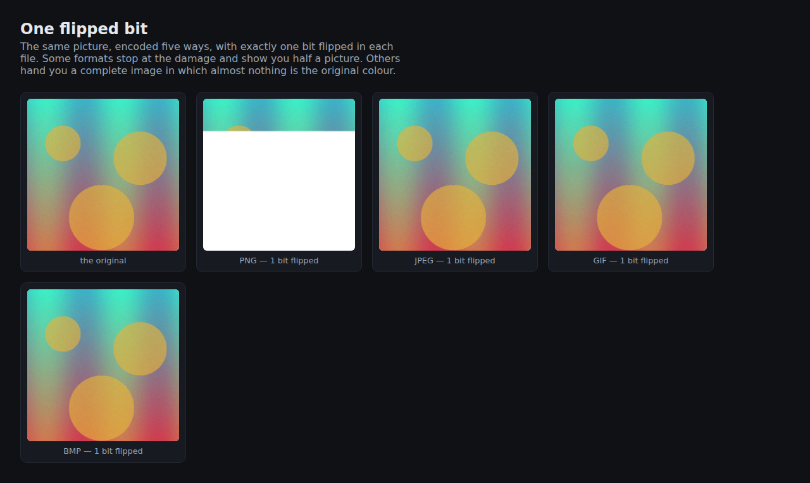

# bitrot-demo

One flipped bit, several image formats. Companion to a dev.to post.

The same picture is encoded as PNG, JPEG, GIF and BMP, then exactly one bit is
flipped in each file. The point is not that damage happens — it is that the
formats fail in completely different ways:



PNG stops at the damage and paints half a picture. JPEG and GIF hand you a
complete image in which almost no pixel is the original colour.

## Run it

```bash
pip install -r requirements.txt
uvicorn main:app --reload
```

`/img?fmt=png&bits=1&seed=3` renders the corrupted file directly; change `bits`
and `seed` to get different damage.

Each selected bit is flipped once, so `bits=N` changes exactly N distinct bits.
Non-positive counts leave the image unchanged. Counts larger than the encoded
image's bit length and formats without an available encoder return HTTP 400.
The same format, count and seed produce the same bytes within a given Pillow build.

## Tests

From the repository root:

```bash
pip install -r requirements-dev.txt
python -m pytest
```

Tests use a tiny in-memory image and FastAPI's test client; no server or network
is needed. They cover encoding, unchanged output, exact bit counts, repeatability,
and unsupported formats (including an unavailable WebP encoder).

One thing worth knowing if you deploy this: some Pillow builds ship without a
WebP *encoder* even though `features.check("webp")` returns True, because that
flag reports decode support. `Image.SAVE` is the registry that actually decides.

MIT licensed.

## Contributing

Issues and pull requests are welcome, and especially so during Hacktoberfest.
The [good first issues](https://github.com/DimitrovK/bitrot-demo/issues?q=is%3Aissue+is%3Aopen+label%3A%22good+first+issue%22)
are small and self-contained on purpose: a damage report next to each image, a
control for how many bits to flip, a hex view of the changed byte, a Dockerfile,
and some tests.
